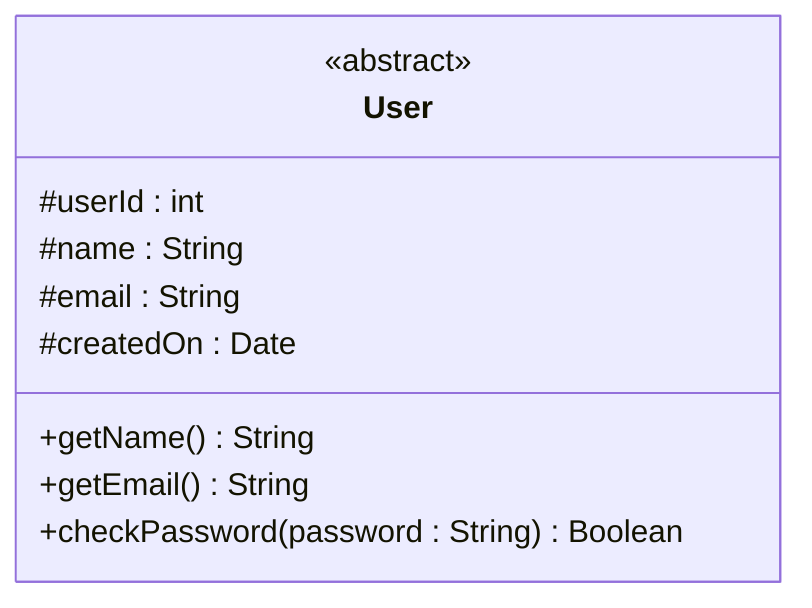

```mermaid
classDiagram
    class User {
        <<abstract>>
        #userId : int
        #name : String
        #email : String
        #createdOn : Date
        +getName() String
        +getEmail() String
        +checkPassword(password : String) Boolean
    }
```